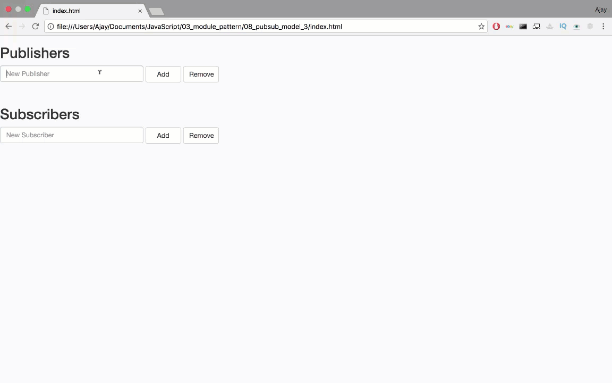
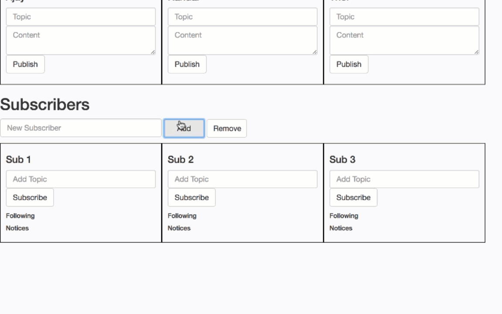
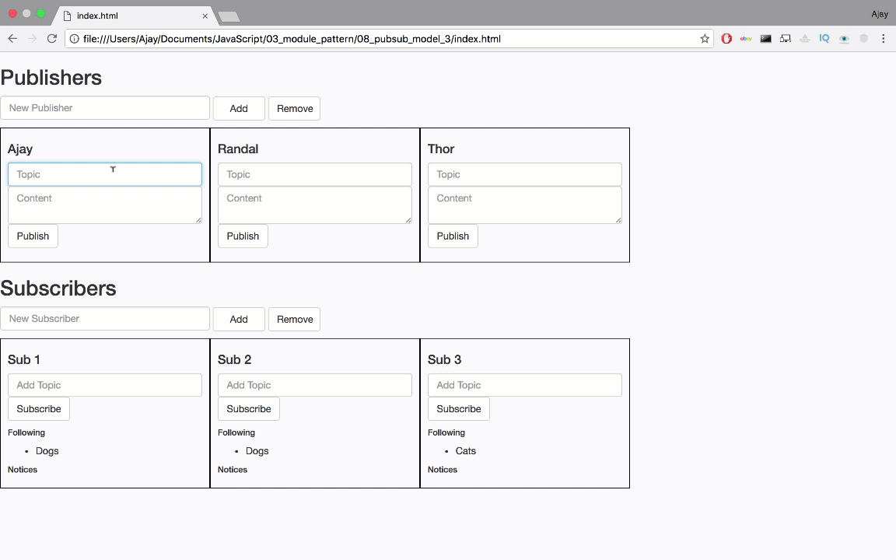

# Publisher-Subscriber model (implementation)

Every "user" has their own list of topics they follow i.e. a list of topics to which they *subscribed*. When one of the *publishers* writes a book/blog, notify the users who subscribed to the topic. Optionally add/remove any number of:

 1. Users(Subscribers)
 2. Publishers
 3. Topics

## Usage

The application has 3 dependencies:
* **Bootstrap**: Front end framework
* **jQuery**: JavaScript library
* **Mustache**: Logicless template synatx

Execute the following command to include all dependencies from package.JSON:

```
npm install
```

Open index.html and start entering the publishers and subscriber details.



Subscribers can now *subscribe* to different topics. 



Subscribers recieve notifications when Publishers publish content on their subscribed topics




## Format of Subscribers
```
subscribers = [
{
    'name':'Ajay',
    'topics':['Cars'],
    'notifications':[{
        'name':'Glor',
        'topic':'Cars',
        'payload':'This is nice'
    }] 
},
{
    'name':'Thor',
    'topics':['Halthor','Cars'],
    'notifications':[]
},
{
    'name':'Slick',
    'topics':['Bottles','Animals'],
    'notifications':[]
},
{
    'name': 'Sassy',
    'topics': ['Tigers', 'Cheetahs','Deer'],
    'notifications':[]
}
];
```

## Format of Publishers
```
publishers =[
{
    'name': 'Glor',
    'works':[
    {
        'topic':'Cars',
        'payload':'All the official Ferrari brand content: dedicated websites for our cars, sporting activities and official products from the Store.'
    }
    ]
},
{
    'name': 'Ron',
    'works':[
    {
        'topic':'Cars',
        'payload':'All the official Ferrari brand content: dedicated websites for our cars, sporting activities and official products from the Store.'
    }
    ]
},
{
    'name': 'Steve',
    'works':[
    {
        'topic':'Cars',
        'payload':'All the official Ferrari brand content: dedicated websites for our cars, sporting activities and official products from the Store.'
    }
    ]
}
];
```

**NOTE**: This is just using client side javaScript. So a page refresh will erase all the data entered. But simply writing to a JSON file when modifying a publisher/subscriber will get you a fully functional application.


